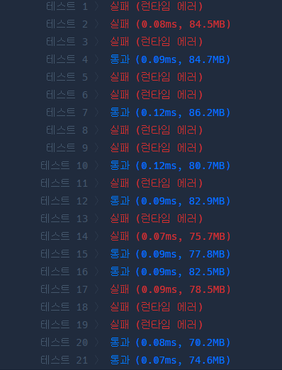

### 게임 맵 최단 거리

```java
import java.util.LinkedList;
import java.util.Queue;

class Solution {
	int[] dx = {1, 0, -1, 0};
	int[] dy = {0, 1, 0, -1};
	// 좌우상하
	public int solution(int[][] maps) {

		int maxX = maps[0].length;
		int maxY = maps.length;
        // 💥이 부분이 문제였음. maxX 행 maxY는 열

		// 경로 별로 값을 넣어줌
		int[][] map = new int[maps.length][maps[0].length];

		Queue<int[]> queue = new LinkedList<>();
		// 최초값 세팅
        map[0][0] = 1;
		queue.add(new int[]{0,0});

		while (!queue.isEmpty()) {
			int[] currentQueue = queue.poll();

			int currentX = currentQueue[0];
			int currentY = currentQueue[1];

			if (currentX == maxX - 1 && currentY == maxY - 1) {
				return map[currentX][currentY];
			}
			for (int i = 0; i < 4; i++) {
				int nextX = currentX + dx[i];
				int nextY = currentY + dy[i];

				// 넘어감
				if (nextX < 0 || nextY < 0 || nextX >= maxX || nextY >= maxY) {
					continue;
				}
				// 벽인경우
				if (maps[nextX][nextY] == 0) {
					continue; //
				}

				// 방문한 경우
				if (map[nextX][nextY] > 0) {
					continue;
				}
				// 해당됨
				map[nextX][nextY] = map[currentX][currentY] + 1; // 이전 단계보다 1 올려야함
				queue.add(new int[] {nextX, nextY});
			}
		}

		return -1;
	}
}
```


에러....

### 단지 번호 붙히기

```java
static int[] dx = {-1, 0, 1, 0};
static int[] dy = {0, 1, -1, 0};

public static int bfs (int n, int[][] map){
	boolean [][] visited = new boolean[n][n]; // 방문여부
	Map<Integer, Integer> houseNumAndCount = new HashMap<>(); // 단지와 세대수

	int maxX = map[0].length;
	int maxY = map.length;

	// 처음부터 시작
	visited[0][0] = true; // 방문
	if(map[0][0]!=0){
	// 세대가 있으면 더해라
	houseNumAndCount.put(map[0][0], houseNumAndCount.getOrDefault(map[0][0], 0)+1);
	}

	// BFS 를 위한 Queue 생성 (끝까지 탐색)
	Queue<int[]> queue = new LinkedList<>();
	queue.add(new int[]{0,0});

	while (!queue.isEmpty()) {
		int[] currentIndex = queue.poll();
		int currentX = currentIndex[0];
		int currentY = currentIndex[1];
		for (int i = 0; i < 4; i++) {
			// 앞뒤 좌우
			int nextX = currentX + dx[i];
			int nextY = currentY + dy[i];
			// 범위를 침범했거나 이미 방문한 경우
			// 건너뜀
			if(nextX <0 || nextY < 0 || nextX >= maxX-1 || nextY >= maxY -1 || visited[nextX][nextY]== true){
			continue;
			}
			// 값이 0이 아니라면
			// 숫자에 해당하는 값 count map 에 담고 값 + 1
			if(map[nextX][nextY] != 0){
				houseNumAndCount.put(map[nextX][nextY], houseNumAndCount.getOrDefault(map[nextX][nextY], 0)+1);
			}
			visited[nextX][nextY] = true; // 방문표시
			queue.add(new int[] {nextX, nextY}); // 다음 queue 적재

		}
	}
	// 총 단지수
	int totalHouseNum = houseNumAndCount.size();
	List<Integer> totalPeopleCount = new ArrayList<>(houseNumAndCount.values());
	Collections.sort(totalPeopleCount);
}
```

이 방법은 지난 BFS 를 바탕으로 풀었는데, 의도하는 바가 다름

- BFS 는 최단 거리
- DFS 현재 문제는 우선 최대한 끝까지 완벽하게 탐색하는 것이 중요
  - 따라서 for 문을 돌면서 메서드를 호출하는 부분이 필요

```java
import java.util.*;
import java.io.*;

public class Main {
	static int map[][];
	static boolean visited[][];
    static int[] dx = {-1, 0, 1, 0};
    static int[] dy = {0, 1, 0, -1};

	static int count = 0, number = 0;
	static int N;

	public static void main(String[] args) throws Exception {
		BufferedReader br = new BufferedReader(new InputStreamReader(System.in));
		BufferedWriter bw = new BufferedWriter(new OutputStreamWriter(System.out));
		List<Integer> list = new ArrayList<>();

		N = Integer.parseInt(br.readLine());
		map = new int[N][N];
		visited = new boolean[N][N];

		for(int i=0; i<N; i++) {
			String str = br.readLine();

			for(int j=0; j<N; j++) {
				map[i][j] = Character.getNumericValue(str.charAt(j));
			}
		}

		for(int i=0; i<N; i++) {
			for(int j=0; j<N; j++) {
                // 좌표 시작하여 끝까지 감
                // 종류당
				if(visited[i][j] == false && map[i][j] == 1) { // ✨ 이 부분, 방문하지 않은 경우에 탐색
					count = 0;
					number++; // 종류 1개 증가
					DFS(i, j);
					list.add(count);
				}

			}
		}

		Collections.sort(list);
		bw.append(number + "\n");
		for(int num : list) {
			bw.append(num + "\n");
		}

		bw.flush();
		bw.close();
	} // End of main

	static void DFS(int currentX, int currentY) {
		visited[currentX][currentY] = true;
		map[currentX][currentY] = number;
		count ++; // 세대수 증가

		for(int i=0; i<4; i++) {
			int nextX = currentX + dx[i];
            int nextY = currentY + dy[i];

            // 범위가 초과될 때
            if(nextX <0 || nextY < 0 || nextX >= N || nextY >= N || visited[nextX][nextY] == true){
                continue;
            }

            // 0 인 경우
            // 이렇게만 하고, visited 안할까 싶었으나 그렇게 되면 number가 1일 때 구분할 수 없었음
            if(map[nextX][nextY] != 1){
                continue;
            }

            visited[nextX][nextY] = true;
            map[nextX][nextY] = number;
            DFS(nextX, nextY);

		}

	} // End of DFS

// End of Range_check
} // End of class
```
