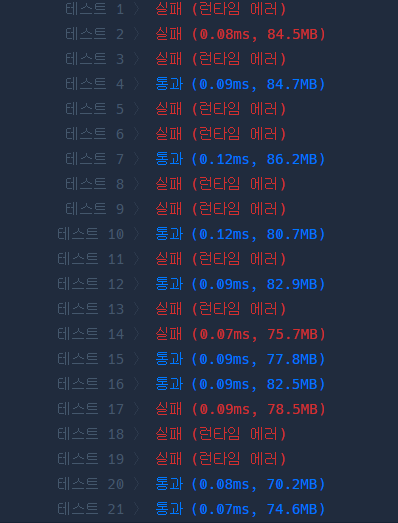

#### 게임 맵 최단 거리

```java
import java.util.LinkedList;
import java.util.Queue;

class Solution {
	int[] dx = {1, 0, -1, 0};
	int[] dy = {0, 1, 0, -1};
	// 좌우상하
	public int solution(int[][] maps) {

		int maxX = maps[0].length;
		int maxY = maps.length;
        // 💥이 부분이 문제였음. maxX 행 maxY는 열

		// 경로 별로 값을 넣어줌
		int[][] map = new int[maps.length][maps[0].length];

		Queue<int[]> queue = new LinkedList<>();
		// 최초값 세팅
        map[0][0] = 1;
		queue.add(new int[]{0,0});

		while (!queue.isEmpty()) {
			int[] currentQueue = queue.poll();

			int currentX = currentQueue[0];
			int currentY = currentQueue[1];

			if (currentX == maxX - 1 && currentY == maxY - 1) {
				return map[currentX][currentY];
			}
			for (int i = 0; i < 4; i++) {
				int nextX = currentX + dx[i];
				int nextY = currentY + dy[i];

				// 넘어감
				if (nextX < 0 || nextY < 0 || nextX >= maxX || nextY >= maxY) {
					continue;
				}
				// 벽인경우
				if (maps[nextX][nextY] == 0) {
					continue; //
				}

				// 방문한 경우
				if (map[nextX][nextY] > 0) {
					continue;
				}
				// 해당됨
				map[nextX][nextY] = map[currentX][currentY] + 1; // 이전 단계보다 1 올려야함
				queue.add(new int[] {nextX, nextY});
			}
		}

		return -1;
	}
}
```


에러....
